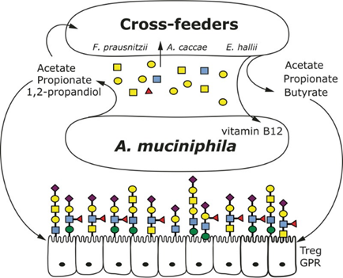

## **A proof-of-concept metabolic model for the small microbial community**

#### **Goal:**
*There is currently no accessible, user-friendly platform that allows researchers to intuitively explore how gut microbial species interact with each other. This project aims to develop an interactive interface where users can visualize microbial dynamics under different biological assumptions. Specifically, the platform enables two modes: (1) a configurable generalized Lotka–Volterra (gLV) model, where users can adjust growth rates and pairwise interaction coefficients and immediately observe the resulting community dynamics; and (2) a mechanistic mode based on AGORA genome-scale metabolic models integrated through MICOM, which simulates cross-feeding, metabolite exchange, and resource competition using constraint-based modeling. Together, these tools provide a flexible, educational, and research-ready environment for demonstrating microbial interactions, nutrient dependencies, and emergent behaviors in gut ecosystems.*
#### **Rationale:**
*Key microbe: Akkermansia muciniphila, a mucin-degrading microbe.*

*Idea flow: Host mucin → Akk → substrates → cross-feeders → B12 + butyrate → host & Akk*

#### **Using the known mechanism for building the model:**

*mBio. 2017 Sep 19;8(5):e00770-17. doi: [10.1128/mBio.00770-17](https://journals.asm.org/doi/10.1128/mbio.00770-17)*